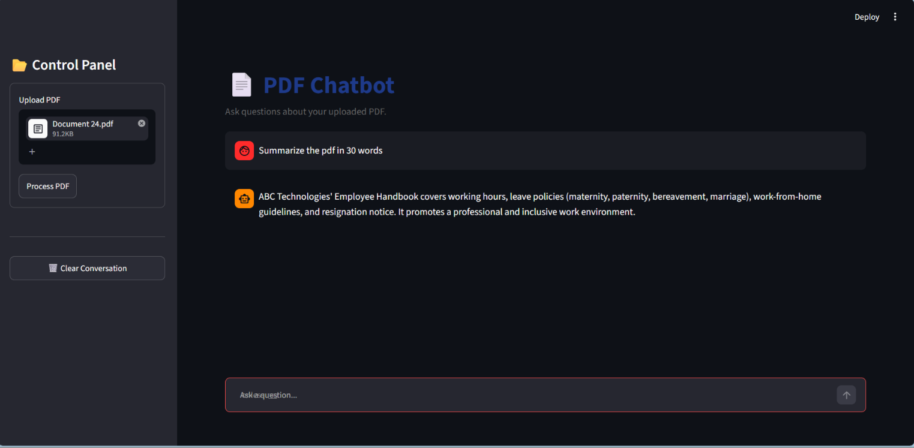

# 📄 PDF Chatbot

An AI-powered chatbot that allows users to interact with PDF documents using natural language. Simply upload one or more PDF files, ask questions, and receive accurate, context-aware answers based on the content of the uploaded documents.

The application uses a **Retrieval-Augmented Generation (RAG)** pipeline, combining **Google Gemini** for response generation, **Hugging Face Embeddings** for semantic search, and **FAISS** as the vector database for efficient document retrieval.

---

## 🚀 Features

* Upload one or multiple PDF documents
* Ask questions in natural language
* AI-generated responses based on document content
* Semantic search using Hugging Face Embeddings
* Fast retrieval with FAISS Vector Database
* Clean and responsive Streamlit interface
* Simple and easy-to-use user experience

---

## 🛠️ Tech Stack

* **Programming Language:** Python
* **Frontend:** Streamlit
* **Framework:** LangChain
* **Large Language Model:** Google Gemini
* **Embeddings:** Hugging Face Embeddings
* **Vector Database:** FAISS
* **PDF Processing:** PyPDF

---

## 📂 Project Structure

```text
pdf-chatbot/
│
├── app.py
├── ingest.py
├── rag.py
├── requirements.txt
├── README.md
├── .gitignore
└── assets/
```

---

## ⚙️ Installation

### 1. Clone the repository

```bash
git clone https://github.com/your-username/pdf-chatbot.git
cd pdf-chatbot
```

### 2. Create a virtual environment

**Windows**

```bash
python -m venv venv
venv\Scripts\activate
```

**Linux/macOS**

```bash
python3 -m venv venv
source venv/bin/activate
```

### 3. Install the required packages

```bash
pip install -r requirements.txt
```

### 4. Create a `.env` file

```env
GOOGLE_API_KEY=your_gemini_api_key
```

### 5. Run the application

```bash
streamlit run app.py
```

The application will start locally, and you can access it in your web browser.

---

## 💡 How It Works

1. Upload one or more PDF documents.
2. Text is extracted from the uploaded PDFs.
3. The extracted text is divided into smaller chunks.
4. Hugging Face generates embeddings for each chunk.
5. The embeddings are stored in a FAISS vector database.
6. When a question is asked, FAISS retrieves the most relevant document chunks.
7. Google Gemini uses the retrieved context to generate an accurate response.

---

## 📸 Screenshots


## 🔮 Future Improvements

* Chat history and conversation memory
* Source citations for answers
* Support for DOCX and PPT files
* PDF summarization
* User authentication
* Cloud deployment
* Docker support

---

## 🤝 Contributing

Contributions are welcome! Feel free to fork this repository, improve the project, and submit a pull request.

---

## 📄 License

This project is licensed under the MIT License.

---

## 👨‍💻 Author

**Karthik Kumar**

Aspiring AI/ML Engineer passionate about Artificial Intelligence, Machine Learning, Data Science, and Generative AI. I enjoy building practical AI applications that solve real-world problems and continuously learning new technologies.

If you found this project useful, consider giving it a ⭐ on GitHub!
